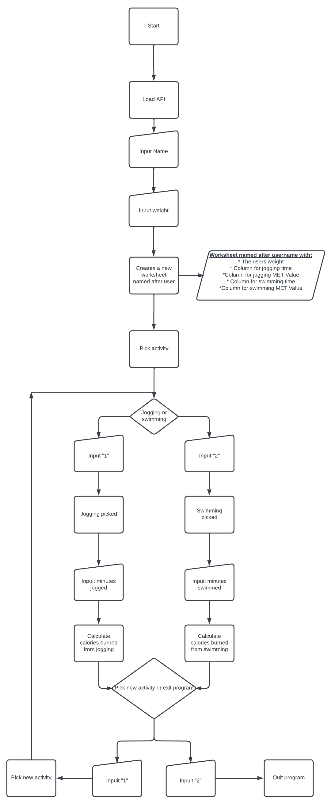
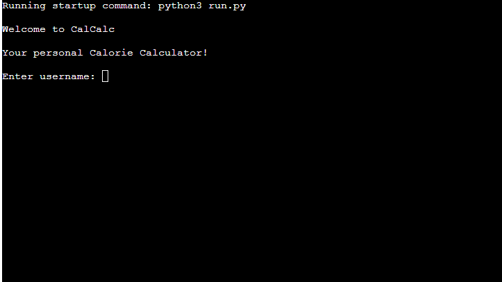
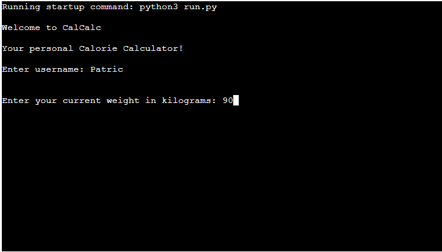
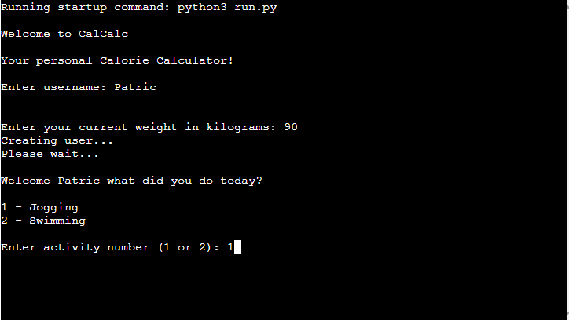
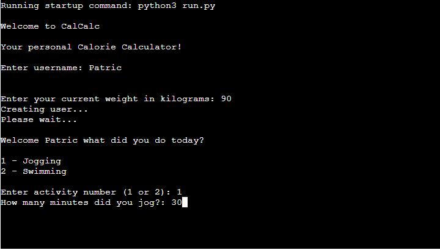
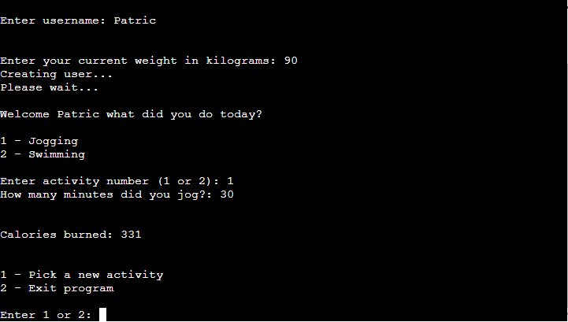
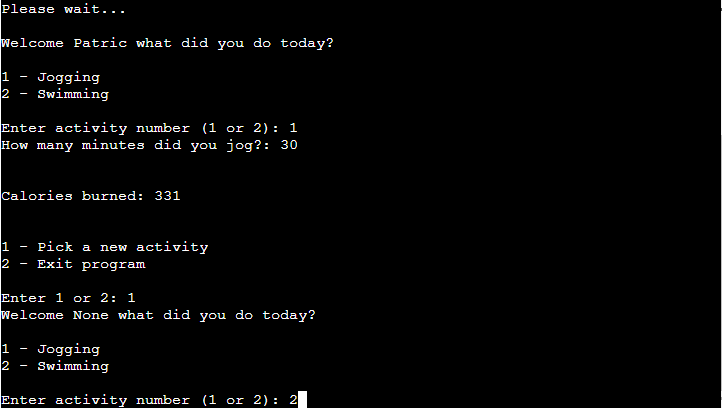
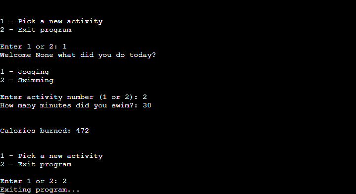
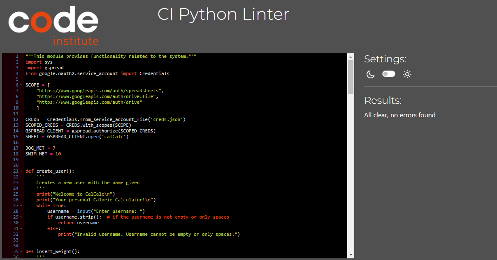

# CalCalc - Calorie Calculator. Project 3 by Patric Svedberg

## [Heroku Deployment](https://calcalc.herokuapp.com/)
 

# Introduction
Project milestone 3 for Code Institute Full-stack development program: Python Terminal.
CalCalc runs in the Code Institute mock terminal on Heroku. The main goal is to calculate the calories burned after an activity.

# User Experience - UX
## User Stories:
* ### User Goals:
    * The user should be able to understand the program without prior experience with it
    * The screen should not be unnecessarily cluttered with text.

* ### Creator Goals:
    * I want to create a program that can be used with as few inputs as possible
    * The worksheet should be easy to understand and read.

# Design

## Flowchart

# Features
## Start
### Setting up the profile
When the program starts the user will be asked to enter a username. Then a worksheet will be created named after the username inside the connected Google Sheet. Next the user will be asked to enter their current weight. This will be used to calculate the calories burned later.
 
 

 
 

## Activity
### Picking and activity
Now the profile is set and the user will be asked to pick and activity. Right now there is only two activities. But more can easily be added. You enter (1) to pick jogging (2) to pick swimming.
 
 

### Enter time
After picking the activity, the user will be asked to enter for how long they did that activity.
 
 

## The calculation
### The equation
The equation i used to calculate how many calories was burned: 
<b>Calories burned = (MET * 3.5 * weight * time) / 200</b>  

<b>MET</b> (Metabolic Equivalent of Task) is a measure of the intensity of physical activity. It is defined as the ratio of the rate at which a person expends energy during an activity, to the rate at which they expend energy while at rest. The value of different activities varies slightly. For this program I used:

* 7 for Jogging
* 10 for Swimming

The cells in your muscles use oxygen to help create the energy needed to move your muscles. One MET is approximately 3.5 milliliters of oxygen consumed per kilogram (kg) of body weight per minute.

So, for example, if you weigh 160 pounds (72.5 kg), you consume about 254 milliliters of oxygen per minute while you’re at rest (72.5 kg x 3.5 mL).
 
[Source - www.healthline.com](https://www.healthline.com/health/what-are-mets#calculation)

### Calculation display
When after the time has been entered the program calculates the calories burned with the equation above and shows it to the user.
 
 

## Pick new activity
### After calculation
After the calculation is done the user is able to enter "1" to pick a new activity. The new activity will be added to the same worksheet.
 

 
 
Entering "2" will exit the program.
 
 

# Storage Data
I have used a Google sheet for this project. This sheet is connected to the code through the Google Drive and Google Sheet API by the Google Cloud Platform. This method allows me to send and receive data as I had access to the Google Sheet API credentials. After the player enters the username a new worksheet is created with the same name as the user. Here the weight and time for each activity is saved.

# Testing

## Known bugs
* <b>2023-03-31:</b> The program prints the calories burned twice.
    * Bug got solved by calling the pick_new_act under the print calories burned somehow. Unsure what caused it in the first place.
## Python Linter
 

# Technologies Used
## Languages Used
* [Python](https://en.wikipedia.org/wiki/Python_(programming_language))

## Softwares used
* [Github](https://github.com/PatSvedberg/cal-calc)
* [Heroku](https://calcalc.herokuapp.com/)
* [CI Python Linter](https://pep8ci.herokuapp.com/#)
* [Lucidchart](https://www.lucidchart.com/pages)
* [Gitpod](https://gitpod.io/)
* [Google Drive](https://drive.google.com/)
* [Google Sheets](https://www.google.com/sheets/about/)